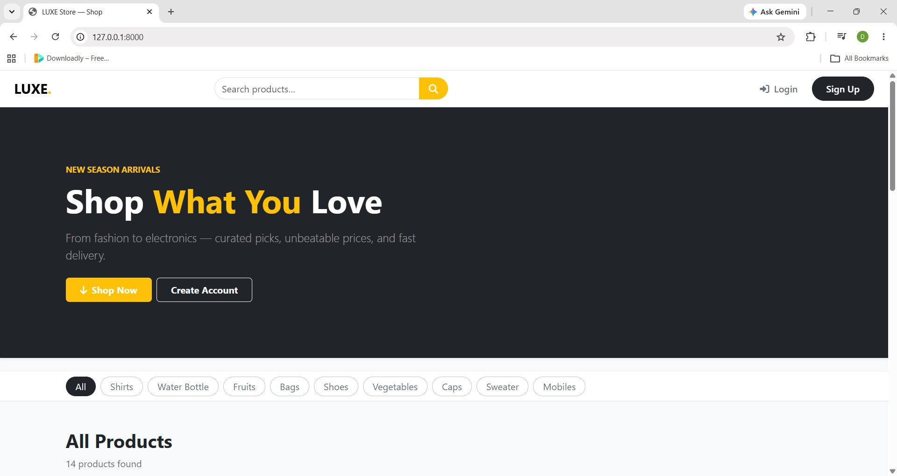
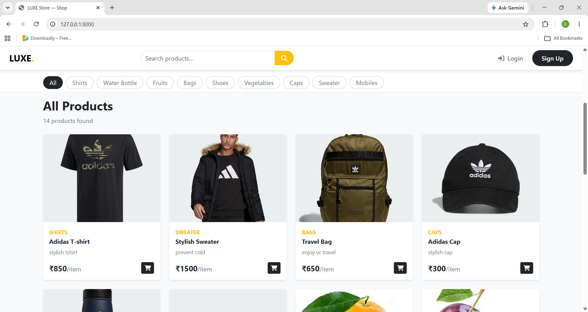
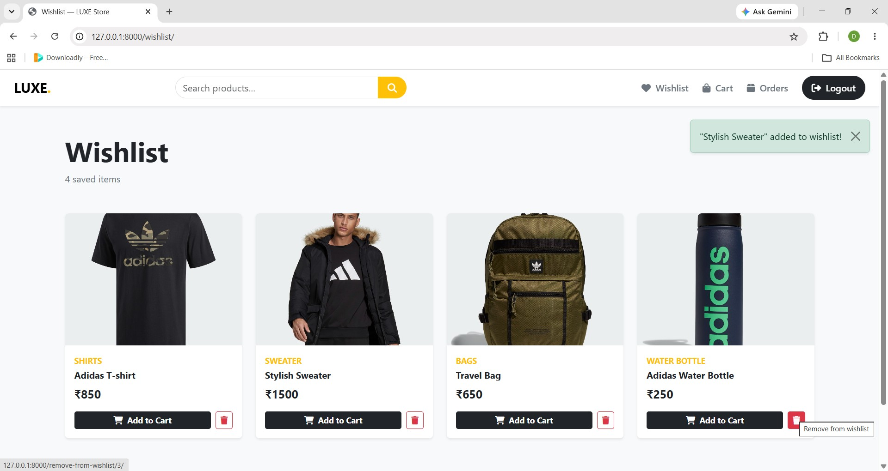
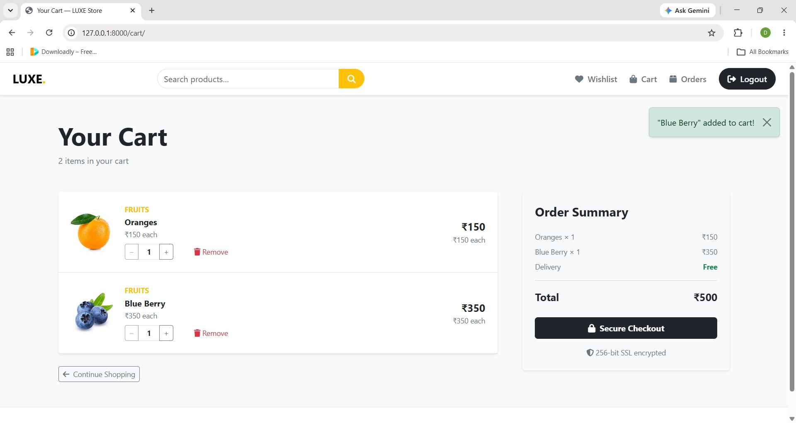
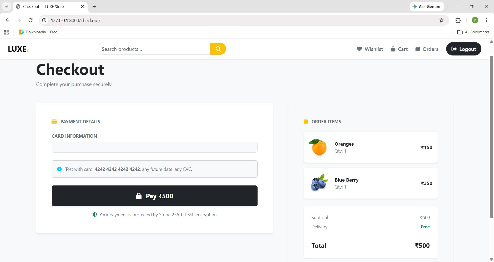
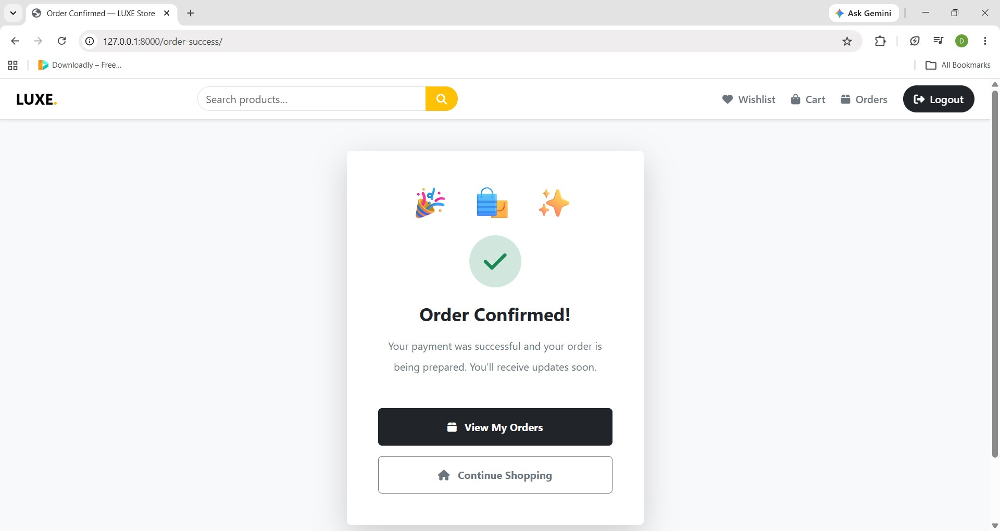
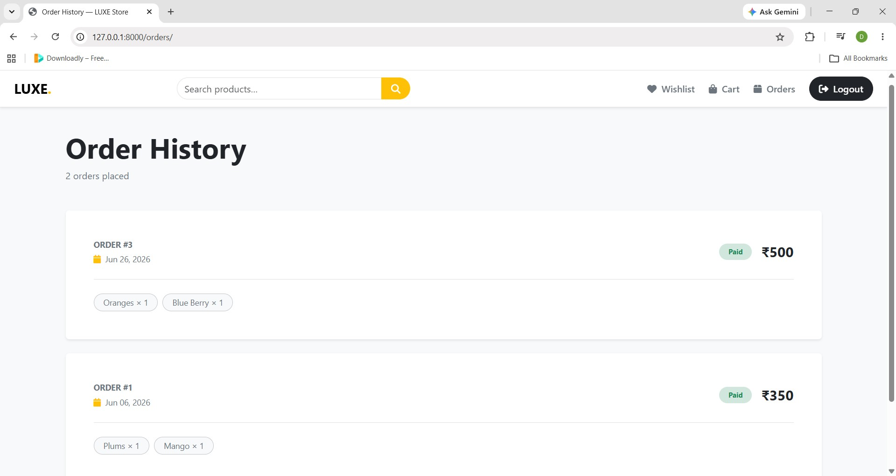
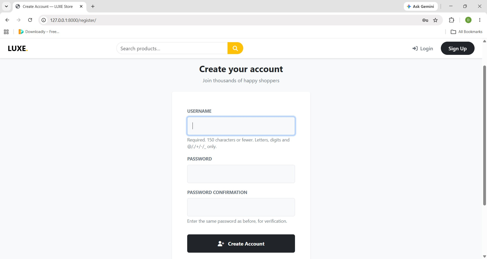
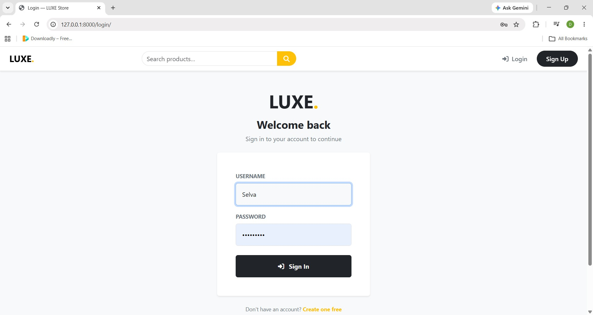

## Ecommerce - LUXE Store

LUXE Store is a full-featured e-commerce web application built with Django. It features a modern, responsive user interface and provides all essential e-commerce functionalities, from product browsing and cart management to secure payments using Stripe.

### Features

- **User Authentication:** Registration, login, and secure user sessions.
- **Product Catalog:** Browse products, search functionality, and category filtering.
- **Shopping Cart:** Add/remove items and manage quantities seamlessly.
- **Wishlist:** Save favorite products for later.
- **Secure Checkout:** Integrated with Stripe API 
- **Order Management:** Track order history and status.
- **Responsive UI:** Works beautifully on both desktop and mobile devices, featuring a sticky navbar and toast notifications.

## Tech Stack

* **Backend:** Django 5.x, Python
* **Database:** SQLite 
* **Payments:** Stripe API 
* **Frontend:** HTML5, CSS3, Bootstrap 5 , Font Awesome, Google Fonts
* **Forms:** django-crispy-forms

## Getting Started

Follow these instructions to set up the project locally on your machine.

### Prerequisites

* Python 3.10 or higher
* pip (Python package installer)
* Git

### Installation

1. **Clone the repository**
   ```bash
   git clone https://github.com/dhurka832/django-ecommerce-store.git
   cd django-ecommerce-store
   ```

2. **Create and activate a virtual environment**
   * Windows:
     ```bash
     python -m venv env
     env\Scripts\activate
     ```
   * macOS / Linux:
     ```bash
     python3 -m venv env
     source env/bin/activate
     ```

3. **Install dependencies**
   ```bash
   pip install -r requirements.txt
   ```

4. **Configure environment variables**
   Create a `.env` file in the project root directory:
   ```env
   STRIPE_SECRET_KEY=sk_test_your_key_here
   STRIPE_PUBLISHABLE_KEY=pk_test_your_key_here
   ```
   > Get your test keys from the [Stripe Dashboard](https://dashboard.stripe.com/test/apikeys).

5. **Run migrations**
   ```bash
   python manage.py makemigrations
   python manage.py migrate
   ```

6. **Create a superuser (for admin access)**
   ```bash
   python manage.py createsuperuser
   ```

7. **Start the development server**
   ```bash
   python manage.py runserver
   ```
   Visit `http://localhost:8000` in your browser.

## Usage

1. Register a new account at `/register/` or login via `/login/`.
2. Browse products, use the search bar, or filter by category on the home page.
3. View product details, and add items to your cart or wishlist.
4. Proceed to checkout via the cart page.
5. Enter a test Stripe card to complete the purchase.
6. Access your order history in your profile or access the Django admin panel at `/admin/` to manage the store.

## Stripe Test Cards

Use the following test cards in the Stripe checkout form (use any future expiry date and any 3-digit CVC):

| Scenario | Card Number |
| :--- | :--- |
| **Payment succeeds** | `4242 4242 4242 4242` |
| **Payment declined** | `4000 0000 0000 0002` |
| **Requires authentication** | `4000 0025 0000 3155` |

## Project Structure

```text
project/
├── manage.py
├── db.sqlite3
├── .env
├── requirements.txt
├── ecommerce/            # Main project configuration
└── store/                # E-commerce application
    ├── models.py         # Database schema
    ├── views.py          # Request handling
    ├── urls.py           # App routing
    └── templates/store/  # HTML templates
```

## Database Models

| Model | Description |
| :--- | :--- |
| `Category` | Product categorization |
| `Product` | Product details, pricing, and images |
| `Cart` & `CartItem` | User shopping sessions and items |
| `Order` & `OrderItem` | Completed purchases and order history |
| `Wishlist` | User's saved items |

## Screenshots 

<p align="center">
  
  
  
  
  
  
  
  
  
</p>
