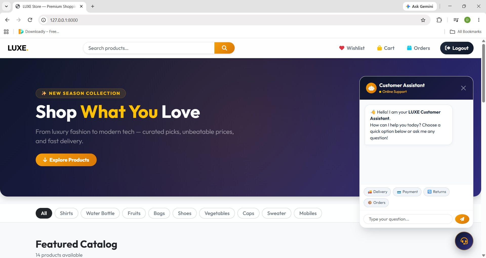

## Ecommerce - LUXE Store (with AI Customer Support Chatbot)

LUXE Store is a full-featured e-commerce web application built with **Django 5.x** and enhanced with an interactive **AI Customer Support Assistant Chatbot**. It provides instant FAQ resolution, product inquiries, user authentication, cart & wishlist management, order tracking, and secure payments via Stripe.

---

### Features

- 💬 **AI Customer Support Chatbot:** Instant assistance for return/refund policies, shipping timeframes, payment methods, order tracking, store information, and product recommendations.
- 🔐 **User Authentication:** Registration, login, and secure user session management.
- 🛍️ **Product Catalog:** Interactive catalog with keyword search and category filtering.
- 🛒 **Shopping Cart:** Add/remove products and manage item quantities seamlessly.
- ❤️ **Wishlist:** Save favorite items to a personalized wishlist.
- 💳 **Secure Checkout:** Full integration with the Stripe Payment API.
- 📦 **Order Management:** Track past orders, order status, and purchase history.
- 📱 **Modern UI & Micro-Animations:** Responsive interface built with Bootstrap 5, custom CSS transitions, and smooth hover effects.

---

## Tech Stack

* **Backend:** Django 5.x, Python 3.10+
* **Database:** SQLite
* **Payments:** Stripe API
* **Frontend:** HTML5, CSS3, Vanilla JavaScript, Bootstrap 5, Font Awesome
* **Forms:** django-crispy-forms

---

## Getting Started

Follow these instructions to set up the project locally.

### Prerequisites

* Python 3.10 or higher
* pip (Python package installer)
* Git

### Installation

1. **Clone the repository**
   ```bash
   git clone https://github.com/dhurka832/django-ecommerce-store.git
   cd django-ecommerce-store
   ```

2. **Create and activate a virtual environment**
   * **Windows**:
     ```bash
     python -m venv venv
     venv\Scripts\activate
     ```
   * **macOS / Linux**:
     ```bash
     python3 -m venv venv
     source venv/bin/activate
     ```

3. **Install dependencies**
   ```bash
   pip install -r requirements.txt
   ```

4. **Configure environment variables**
   Create a `.env` file in the project root:
   ```env
   STRIPE_SECRET_KEY=sk_test_your_key_here
   STRIPE_PUBLISHABLE_KEY=pk_test_your_key_here
   ```

5. **Run database migrations**
   ```bash
   python manage.py makemigrations
   python manage.py migrate
   ```

6. **Create a superuser (for admin access)**
   ```bash
   python manage.py createsuperuser
   ```

7. **Start the development server**
   ```bash
   python manage.py runserver
   ```
   Visit `http://localhost:8000` in your browser.

---

## Project Structure

```text
project/
├── manage.py
├── db.sqlite3
├── .env
├── requirements.txt
├── ecommerce/            # Main project configuration (settings, urls)
└── store/                # E-commerce application
    ├── models.py         # Database schema (Product, Order, Cart, etc.)
    ├── views.py          # Request handlers & Chatbot API endpoint
    ├── urls.py           # App routing
    ├── static/           # CSS animations & Chatbot JavaScript
    └── templates/store/  # HTML templates
```

---

## Database Models

| Model | Description |
| :--- | :--- |
| `Category` | Product categorization |
| `Product` | Product details, pricing, descriptions, and media |
| `Cart` & `CartItem` | User shopping sessions and items |
| `Order` & `OrderItem` | Completed purchases and order history |
| `Wishlist` | User's saved favorite items |

---

## Screenshots 

<p align="center">
  
  
  
  
  
  
  
  
  
  
</p>