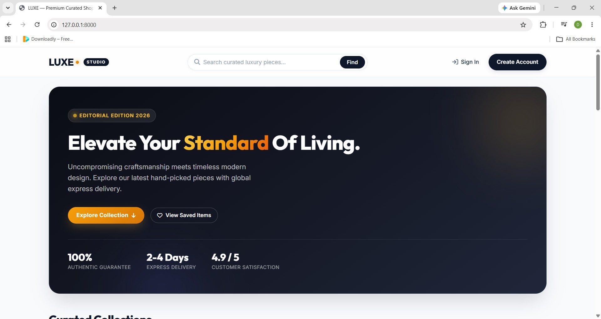
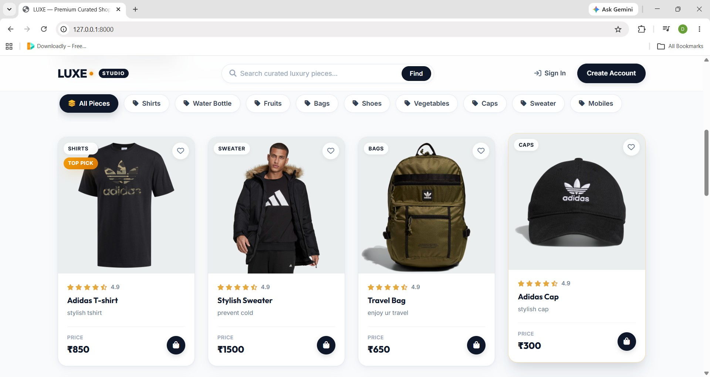
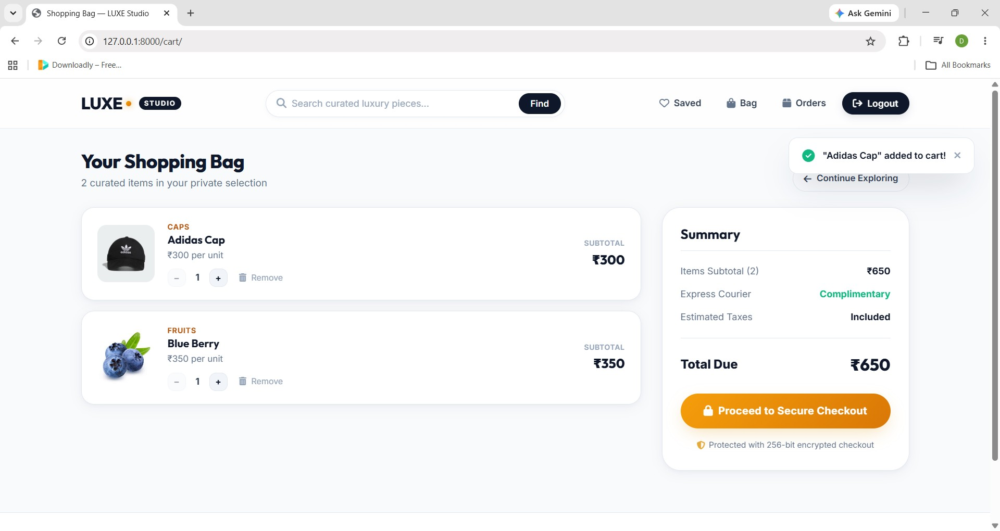
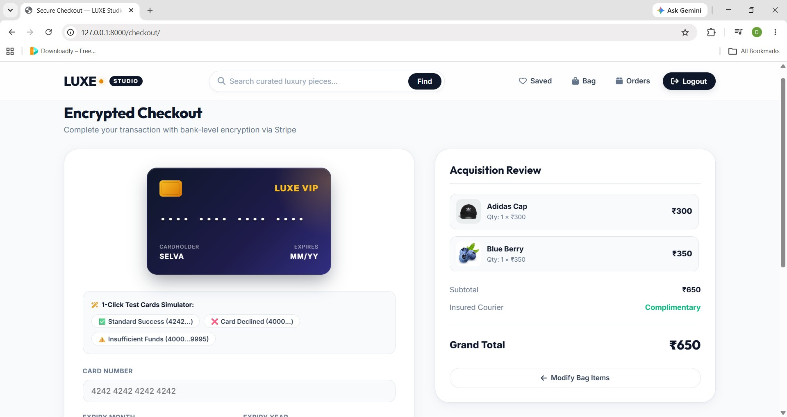

# 🛍️ LUXE — Full-Stack E-Commerce Platform

A sleek, full-featured e-commerce web platform built with **Django 5** and **Modern Pure CSS3 / JavaScript** (zero UI framework overhead), featuring full catalog discovery, persistent carts, and end-to-end **Stripe Payment** integration.

---

## ✨ Features

- **Product Discovery:** Instant search and category-based filtering across product collections.
- **Cart & Wishlist:** Persistent session/user cart management with quantity steppers and quick wishlist toggle.
- **Secure Stripe Checkout:** Integrated Stripe API payment gateway with interactive test card presets.
- **Order Management:** Real-time post-checkout confirmation and persistent order history tracking.
- **User Authentication:** Secure registration, login/logout, and protected client views.
- **Modern Bespoke UI:** Pure CSS3 styling (Flexbox/Grid), custom typography (`Outfit` + `Inter`), and responsive mobile drawer navigation.

---

## 🛠️ Tech Stack

| Layer | Technologies |
|---|---|
| **Backend** | Python 3.10+, Django 5.x, Django ORM, SQLite |
| **Payments** | Stripe API |
| **Frontend** | HTML5, Modern CSS3, Vanilla JavaScript (ES6+) |
| **Typography & Icons** | Google Fonts (Outfit, Inter), Font Awesome 6 |

---

## 📸 Preview

<p align="center">
  
  
</p>
<p align="center">
  
  
</p>

---

## 🚀 Quick Start

### 1. Setup Environment
```bash
git clone https://github.com/dhurka832/django-ecommerce-store.git
cd django-ecommerce-store
python -m venv venv
# Windows:
venv\Scripts\activate
# macOS/Linux:
source venv/bin/activate
```

### 2. Install Dependencies
```bash
pip install -r requirements.txt
```

### 3. Configure Environment Variables
Create a `.env` file in the project root:
```env
STRIPE_SECRET_KEY=sk_test_your_secret_key
STRIPE_PUBLISHABLE_KEY=pk_test_your_publishable_key
```

### 4. Run Migrations & Start Server
```bash
python manage.py migrate
python manage.py runserver
```
Visit `http://localhost:8000`

---

## 🔑 Demo Account
- **Username:** `Selva`
- **Password:** `Selva@345`

---

## 📁 Project Structure

```text
Ecommerce/
├── ecommerce/          # Django core settings & base URL routing
├── store/              # Commerce app (models, views, routes)
│   ├── static/store/   # Custom CSS stylesheets & JS scripts
│   ├── templates/store/# Modular HTML5 templates
│   ├── models.py       # Product, Category, Cart, Order, Wishlist
│   └── views.py        # Application views & checkout logic
├── media/              # Uploaded product media assets
└── manage.py           # Django CLI management script
```

---

